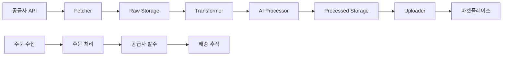

# 📑 드랍쉬핑 자동화 시스템 PRD v2.0

작성일: 2025-07-06 | 최종 수정: 2025-07-06

---

## 1. 개요

### 1.1 프로젝트 목표
여러 공급사의 상품을 **수집** → **AI 가공** → **다중 마켓플레이스 업로드** → **주문/배송 관리**까지 완전 자동화하는 드랍쉬핑 통합 플랫폼

### 1.2 핵심 가치
- **완전 자동화**: 24/7 무인 운영 가능한 시스템
- **확장성**: 새로운 공급사/마켓플레이스 쉽게 추가
- **지능화**: AI 기반 상품 최적화 및 소싱 인텔리전스
- **안정성**: 에러 복원력과 모니터링 시스템

### 1.3 기술 스택
- **Backend**: Python 3.11+, FastAPI, asyncio
- **Database**: Supabase (PostgreSQL 16)
- **AI**: Ollama (로컬), Gemini API (클라우드)
- **Queue**: APScheduler
- **Monitoring**: Grafana, Prometheus, Slack

---

## 2. 시스템 아키텍처

### 2.1 모듈 구조
```
dropshipping/
├── suppliers/           # 공급사 통합 (BaseFetcher)
│   ├── domeme/         # 도매매 API [✅ 구현]
│   ├── ownerclan/      # 오너클랜 GraphQL [🚧 진행중]
│   └── zentrade/       # 젠트레이드 FTP [📋 계획]
├── transformers/        # 데이터 표준화
├── storage/            # Supabase 저장소 [✅ 구현]
├── ai_processors/      # AI 가공 파이프라인 [✅ 구현]
│   ├── product_enhancer.py
│   ├── image_processor.py
│   └── model_router.py
├── uploader/           # 마켓플레이스 통합
│   ├── coupang.py      # 쿠팡 WING API [✅ 구현]
│   ├── elevenst.py     # 11번가 [🚧 진행중]
│   └── smartstore.py   # 스마트스토어 [🚧 진행중]
├── orders/             # 주문 관리 [🚧 진행중]
│   ├── collector/      # 주문 수집
│   ├── delivery/       # 배송 추적
│   └── supplier/       # 공급사 발주
├── sourcing/           # 소싱 인텔리전스 [✅ 구현]
│   ├── self_sales/     # 내부 판매 분석
│   ├── competitor/     # 경쟁사 분석
│   └── scorer/         # 상품 점수화
├── scheduler/          # 작업 스케줄러 [✅ 구현]
├── monitoring/         # 모니터링/알림 [✅ 구현]
├── api/               # REST API [✅ 구현]
└── mcp/               # MCP 도구 [🚧 진행중]
```

### 2.2 데이터 플로우


---

## 3. 데이터베이스 설계

### 3.1 주요 테이블 (16개)
| 범주 | 테이블명 | 용도 |
|------|----------|------|
| **메타데이터** | suppliers, marketplaces, seller_accounts, ai_models | 시스템 설정 |
| **상품** | products_raw, products_processed, product_variants, products_ai_enhanced | 상품 데이터 |
| **마켓** | marketplace_listings | 마켓 업로드 상태 |
| **규칙** | category_mappings, pricing_rules | 비즈니스 룰 |
| **주문** | orders, inventory_sync_logs | 주문/재고 관리 |
| **소싱** | keyword_research, competitor_products | 시장 분석 |
| **로그** | pipeline_logs | 처리 이력 |

### 3.2 보안
- Row Level Security (RLS) 적용
- API 키는 별도 환경변수 관리
- credential_json 필드 암호화

---

## 4. 핵심 기능

### 4.1 상품 수집 (Suppliers)
- **구현 완료**: Domeme (도매매/도매꾹)
- **진행중**: Ownerclan (오너클랜)
- **계획**: Zentrade, Excel 일괄 업로드

**특징**:
- 증분 수집 (최신 상품 우선)
- 원본 데이터 보존 (JSONB)
- 중복 제거 (해시 기반)

### 4.2 AI 가공 (AI Processors)
- **상품명 최적화**: SEO 키워드, 트렌드 반영
- **설명 생성**: HTML 정제, 마켓별 최적화
- **이미지 처리**: 배경 제거, 워터마크 추가
- **가격 최적화**: 경쟁사 분석 기반

**모델 라우팅**:
```python
# 작업 복잡도에 따른 자동 모델 선택
간단한 작업 → Ollama (로컬)
복잡한 작업 → Gemini Pro (클라우드)
```

### 4.3 마켓플레이스 업로드
- **API 방식**: 쿠팡, 11번가, 스마트스토어
- **Excel 방식**: G마켓, 옥션

**기능**:
- 멀티 계정 지원
- 업로드 상태 추적
- 실패 시 재시도
- 카테고리 자동 매핑

### 4.4 주문/배송 관리
- 마켓별 주문 자동 수집
- 공급사 자동 발주 (API/Excel)
- 실시간 배송 추적
- 재고 동기화

### 4.5 소싱 인텔리전스
- 내부 베스트셀러 분석
- 경쟁사 상품 모니터링
- 키워드 트렌드 분석
- AI 기반 상품 추천

---

## 5. 구현 현황 및 로드맵

### 5.1 현재 상태 (2025-07-06)
| 모듈 | 상태 | 설명 |
|------|------|------|
| **Core Architecture** | ✅ 완료 | 베이스 클래스, 레지스트리 시스템 |
| **Database** | ✅ 완료 | 16개 테이블, RLS, 마이그레이션 |
| **Domeme Supplier** | ✅ 완료 | API 연동, 테스트 완료 |
| **AI Processing** | ✅ 완료 | 전체 파이프라인 구현 |
| **Coupang Upload** | ✅ 완료 | WING API 연동 |
| **Scheduler** | ✅ 완료 | APScheduler 기반 |
| **Monitoring** | ✅ 완료 | Slack 알림, 메트릭 |
| **API Server** | ✅ 완료 | FastAPI REST |
| **Ownerclan** | 🚧 70% | Transformer 구현 필요 |
| **Order Management** | 🚧 60% | 기본 구조 완성, 상세 구현 중 |
| **Other Marketplaces** | 🚧 30% | 기본 구조만 구현 |

### 5.2 단기 로드맵 (1개월)
1. **Week 1**: Ownerclan transformer 완성
2. **Week 2**: 주문 관리 모듈 완성
3. **Week 3**: 11번가, 스마트스토어 업로더
4. **Week 4**: 통합 테스트 및 안정화

### 5.3 중장기 로드맵 (3-6개월)
- Zentrade 공급사 통합
- Excel 대량 업로드 기능
- 고급 소싱 알고리즘
- 모바일 관리 앱
- 다국어 지원

---

## 6. 기술 요구사항

### 6.1 성능
- 10,000 SKU 처리: < 30분
- API 응답 시간: < 500ms
- 동시 처리: 100개 상품

### 6.2 확장성
- 새 공급사 추가: 2일 이내
- 새 마켓 추가: 3일 이내
- 수평 확장 가능 (멀티 인스턴스)

### 6.3 안정성
- 99.9% 가용성 목표
- 자동 에러 복구
- 실시간 모니터링
- 일일 백업

### 6.4 보안
- API 키 암호화
- RLS 기반 접근 제어
- 감사 로그
- HTTPS only

---

## 7. 개발 가이드

### 7.1 환경 설정
```bash
# 필수 환경변수
SUPABASE_URL=https://xxx.supabase.co
SUPABASE_KEY=your-anon-key
GEMINI_API_KEY=xxx
OLLAMA_HOST=http://localhost:11434

# 공급사 API
DOMEME_API_KEY=xxx
OWNERCLAN_TOKEN=xxx

# 마켓플레이스 API
COUPANG_ACCESS_KEY=xxx
COUPANG_SECRET_KEY=xxx
```

### 7.2 새 공급사 추가
1. `suppliers/new_supplier/` 생성
2. `BaseFetcher` 상속 구현
3. `BaseTransformer` 상속 구현
4. 테스트 작성
5. Registry 등록

### 7.3 새 마켓플레이스 추가
1. `uploader/new_market.py` 생성
2. `BaseUploader` 상속 구현
3. 필수 메서드 구현
4. 환경변수 추가
5. Registry 등록

---

## 8. 리스크 및 대응

| 리스크 | 영향 | 대응 방안 |
|--------|------|-----------|
| API 변경 | 수집 중단 | 버전 관리, 빠른 패치 |
| 마켓 정책 변경 | 계정 정지 | 정책 모니터링, 컴플라이언스 |
| AI 비용 증가 | 수익성 하락 | 비용 상한선, 로컬 모델 활용 |
| 대량 트래픽 | 성능 저하 | 캐싱, 큐 시스템 |

---

## 9. 성공 지표 (KPI)

### 9.1 기술 지표
- 일일 처리 상품 수
- 평균 처리 시간
- 에러율
- API 응답 시간

### 9.2 비즈니스 지표
- 등록 상품 수
- 전환율
- 평균 마진율
- 월 매출액

---

## 10. 부록

### 10.1 용어 정의
- **SKU**: Stock Keeping Unit (재고 관리 단위)
- **RLS**: Row Level Security (행 수준 보안)
- **MCP**: Model Context Protocol
- **드랍쉬핑**: 재고 없이 주문 시 공급사 직배송

### 10.2 참고 문서
- [CLAUDE.md](../CLAUDE.md) - 개발 가이드
- [Database Schema](../db/schema.sql)
- [API Documentation](../docs/api.md)

---

**문서 버전 관리**
- v2.0 (2025-07-06): 실제 구현 상태 반영, 구조 개선
- v1.0 (2025-07-04): 초기 작성